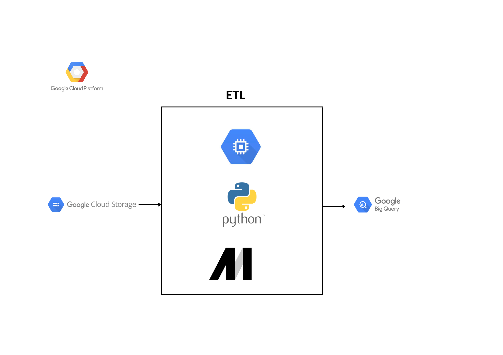

# Projeto de Engenharia de Dados com GCP | Análise de Dados das Exportações Brasileiras

> Dando continuidade as atividades de Análise de Dados do Setor Público Brasileiro, crio este projeto ligado a Engenharia de Dados.

## Intrudução
Tendo como ponto de partida tecnologias do Google Engine, realizo atividades de ingestão de dados com a ferramenta Mage  e disponibilizo-as no Google Storage, em seguida, crio uma modelagem de dados via Python a fim de normalizar e disponibilizar, de forma independente, as Informações no Google BigQuery e acessa-las via SQL ou criações de Dashboards analíticos. 

## Computação em Nuvem 
> <a href="https://console.cloud.google.com/">Google Cloud Platform(Cloud Storage, Compute Engine, BigQuery)</a>

## Linguagem de programação 
> <a href="https://www.python.org/">Python</a> 
> <a href="https://pt.wikipedia.org/wiki/SQL">SQL</a>

## Bibliotecas e Frameworks
> <a href="https://numpy.org/">Numpy</a>
> <a href="https://pandas.pydata.org/">Pandas</a>
> <a href="https://scikit-learn.org/stable/">Scikit-Learn</a>

## Ferramenta para ETL
> <a href="https://www.mage.ai/">Mage Data Pipeline Tool</a>

## Conjunto de Dados Utilizado
Dados compartilhados pelo <a href="https://www.gov.br/produtividade-e-comercio-exterior/pt-br/assuntos/comercio-exterior/estatisticas/base-de-dados-bruta">Ministério da Economia.</a>

## Modelagem de Dados

## Arquitetura

## ETL Mage

## Entrega dos Dados com BigQuery

Contribua para este belo projeto de código aberto - https://github.com/mage-ai/mage-ai

Mais informações <a href="https://www.linkedin.com/in/mario-barcelos/">Mario Barcelos</a>

