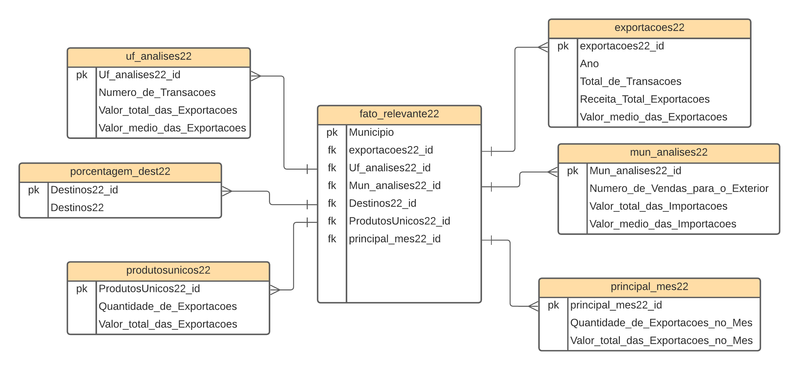
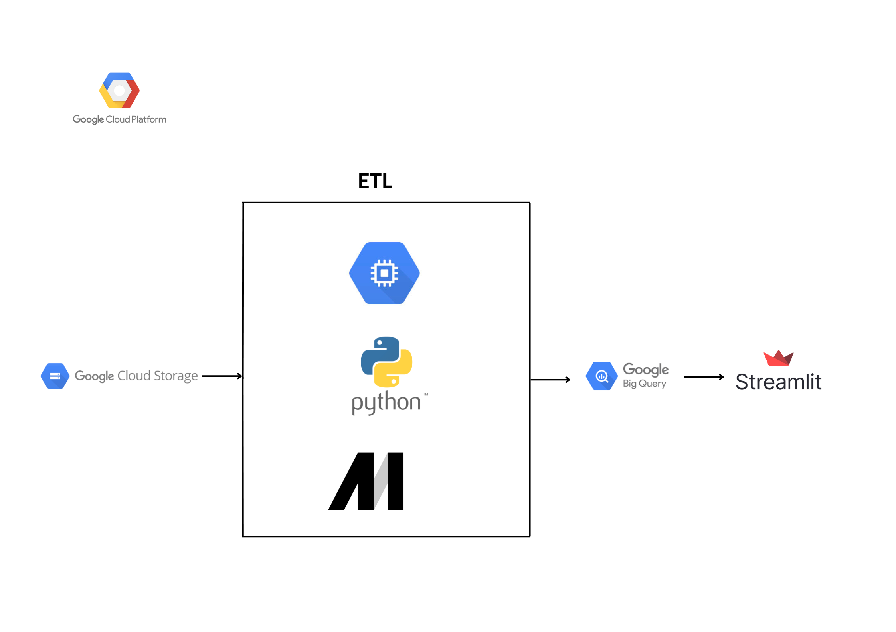
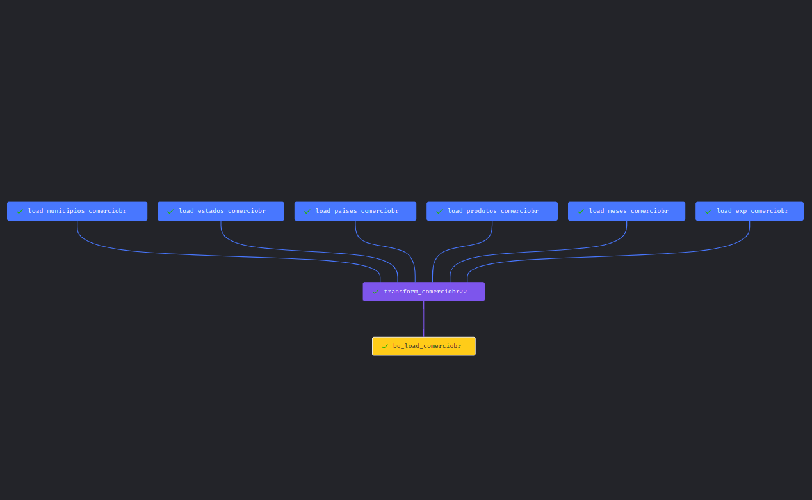
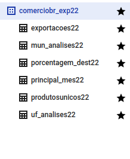

# Projeto de Engenharia de Dados com GCP | Análise de Dados das Exportações Brasileiras

> Dando continuidade as atividades de Análise de Dados do Setor Público Brasileiro, crio este projeto ligado a Engenharia de Dados.

## Intrudução
Criando um cenário do mundo 'real' coleto os Dados do orgão Federal e disponibilizo no Google Storage, ativo as tecnologias do Google Engine e crio uma 'VM' afim de obter melhor performace, configurado o ambiente de produção executo o de ETL, estraindo os Dados do Google Storage e Transformando utilizando a Linguagme de Progamação Python, de forma independente carrego as Informações utilizando o Google BigQuery, entregando no final  6 'Tabelas' formatadas prontas para geração de Dashboard.

Utilizando o Streamlit entrego de forma 'opensource' alguns resumos em Dashboard afim de serem utilizados por tomadores de decisão. 

## Computação em Nuvem 
> <a href="https://console.cloud.google.com/">Google Cloud Platform(Cloud Storage, Compute Engine, BigQuery)</a>

## Linguagem de programação 
> <a href="https://www.python.org/">Python</a> 
> <a href="https://pt.wikipedia.org/wiki/SQL">SQL</a>

## Bibliotecas e Frameworks
> <a href="https://numpy.org/">Numpy</a>
> <a href="https://pandas.pydata.org/">Pandas</a>
> <a href="https://scikit-learn.org/stable/">Scikit-Learn</a>

## Ferramenta para ETL
> <a href="https://www.mage.ai/">Mage Data Pipeline Tool</a>

 ## Visualização
> <a href="https://streamlit.io/">Streamlit</a>

## Conjunto de Dados Utilizado
Dados compartilhados pelo <a href="https://www.gov.br/produtividade-e-comercio-exterior/pt-br/assuntos/comercio-exterior/estatisticas/base-de-dados-bruta">Ministério da Economia.</a>

## Modelagem de Dados

## Arquitetura

## ETL Mage

## Entrega dos Dados com BigQuery

Contribua para este belo projeto de código aberto - https://github.com/mage-ai/mage-ai

Mais informações <a href="https://www.linkedin.com/in/mario-barcelos/">Mario Barcelos</a>

